# PHÂN TÍCH VÀ THIẾT KẾ HỆ THỐNG WEBSITE MUA BÁN, QUẢN LÝ SÁCH

### Ở chương này phân tích thiết kế hệ thống theo hướng đối tượng, phân tích các tác nhân, chức năng của hệ thống, mô hình hóa cơ sở dữ liệu của hệ thống.

### 1. Phân tích yêu cầu của hệ thống

Sau khi khảo sát hiện trạng ở trên, một yêu cầu cấp thiết cần đặt ra là xây dựng và phát triển một Website đáp ứng được nhu cầu tìm kiếm sách, đặt mua sách... Việc xây dựng website phải đáp ứng được những yêu cầu sau:

#### 1.1Đăng nhập hệ thống : Được phân quyền giữa khách hàng và admin

- Khách hàng :

  - Khi đặt mua sản phẩm và muốn thanh toán và xác nhận mua sản phẩm thì khách hàng cần đăng nhập vào hệ thống để xác nhận, khi đó mới có thể có thông tin để lưu trữ vào hệ thống như lịch sử mua hàng, tình trạng giao hàng… Bên cạnh đó khách hàng có thể kiểm tra những sản phẩm mình đã mua khi đăng nhập vào bằng mục lịch sử mua hàng sẽ hiện bảng gồm : tên sách, số lượng mua, giá sản phẩm, ngày mua, tình trạng thanh toán...
  - Khi đăng nhập cần cung cấp tên người dùng và password trong đó nếu đăng nhập sai 3 lần trở lên sẽ xuất hiện captcha để tránh tình trạng dò pass.

- Quản lý : Khi đăng nhập với phân quyền là admin thì sẽ được chuyển đến trang web quản lý gồm các chức năng như quản lý sách, quản lý loại sách… Chỉ có ai có tài khoản mới đăng nhập được và thao tác thay đổi thông tin tránh tình trạng bị lộ thông tin quan trọng và mất dữ liệu.

#### 1.2 Đăng ký tài khoản :

- Khách hàng khi muốn đặt hàng nhưng chưa có tài khoản có thể tự tạo tài khoản cho riêng mình. Khi tạo cần họ tên, tên người dùng, số điện thoại, password. Khi tên người dùng đã trùng với khách nào đó đã tạo trước thì sẽ thông báo đã tồn tại. Bên cạnh đó pass sẽ được nhập 2 lần để kiểm tra xem có nhập sai pass khi đăng ký không. Pass khi đăng ký sẽ được mã hoá trước khi lưu vào cơ sở dữ liệu tránh lộ pass của khách hàng.

- Admin sẽ được chủ tạo cho tài khoản làm việc như nhận việc quản lý web bán hàng của cửa hàng. Nếu chưa thì có thể sử dụng 1 tài khoản chung có tên người dùng là admin.

#### 1.3 Trang chủ:

- Hiển thị danh sách sách có trong cửa hàng, khách hàng có thể thấy khi truy cập vào trang web để mua sách. Bên cạnh đó chúng ta có thanh tìm kiếm khi muốn tìm kiếm theo tên sách và tìm kiếm theo loại sách.

  1.4 Giỏ hàng:

- Thêm sản phẩm vào giỏ hàng: Người dùng có khả năng thêm sách vào giỏ hàng từ trang danh sách sản phẩm khi muốn mua sản phẩm đó.

- Xóa sản phẩm khỏi giỏ hàng: Người dùng cần có khả năng loại bỏ sản phẩm ra khỏi giỏ hàng. Có 3 loại xoá sản phẩm bao gồm xóa từng sản phẩm, xóa nhiều sản phẩm được chọn và xóa tất cả sản phẩm đã đặt. Sau khi bấm vào nút sẽ có ô xác nhận xoá để xác nhận lại khách hàng có muốn thực hiện không hay chỉ nhầm lẫn.

* Xoá từng sản phẩm : Sẽ có nút riêng cho từng sản phẩm đã được thêm vào giỏ hàng, khi bấm vào sẽ xoá sản phẩm đó.
* Xóa sản phẩm được chọn: Xoá những sản phẩm đã được khách hàng tick vào checkbox, chức năng này giúp giảm thời gian khi phải xóa 1 lúc nhiều sản phẩm.
* Xoá tất cả sản phẩm giúp khách hàng có thể xoá tất cả các sản phẩm đã đặt khi muốn đặt lại hết.

- Cập nhật số lượng sản phẩm: Người dùng cần có khả năng cập nhật tăng giảm số lượng sản phẩm trong giỏ hàng khi muốn mua thêm hoặc giảm bớt.

- Tính tổng tiền: Hệ thống phải tính tổng giá trị của các sản phẩm trong giỏ hàng và hiển thị cho người dùng.

- Lưu trạng thái giỏ hàng: Hệ thống cần lưu trạng thái giỏ hàng của người dùng để họ có thể quay lại sau khi thoát khỏi trang web. Nếu muốn thực hiện điều này thì người dùng cần phải đăng nhập vào hệ thống.

#### 1.5 Xác nhận mua hàng:

- Thông tin giao hàng: Người dùng cần nhập thông tin vận chuyển như địa chỉ giao hàng, tên, số điện thoại, v.v.

- Chọn phương thức thanh toán: Người dùng cần có khả năng chọn phương thức thanh toán, ví dụ: thẻ tín dụng, chuyển khoản ngân hàng, thanh toán khi nhận hàng (COD).

- Tính toán tổng cộng: Hệ thống cần tính tổng tiền cần thanh toán sau khi áp dụng các ưu đãi, thuế và phí vận chuyển (nếu có).

- Xác nhận đơn hàng: Người dùng cần xem lại đơn hàng và xác nhận mua hàng trước khi hoàn thành giao dịch.

- Xử lý đơn hàng: Sau khi xác nhận mua hàng, hệ thống cần xử lý đơn hàng bằng cách giảm số lượng sách trong kho và lưu thông tin đơn hàng.

- Gửi xác nhận đơn hàng: Hệ thống cần gửi email xác nhận đơn hàng cho người dùng và cung cấp số theo dõi đơn hàng (nếu có).

#### 1.6 Xác nhận thanh toán (admin)

- Khi khách hàng xác nhận thanh toán đơn hàng, thì bên admin sẽ được thông báo rằng khách hàng đã xác nhận thanh toán hóa đơn sản phẩm đã mua.

- Thanh toán bằng phương thức chuyển khoản trực tuyến:

  - Người mua sẽ xem lại thông tin đơn hàng, bao gồm sản phẩm đã chọn và thông tin thanh toán, để đảm bảo rằng mọi chi tiết đã được nhập đúng.
  - Sau khi xác nhận đơn hàng, người mua sẽ gửi yêu cầu chuyển khoản. Thông tin này sẽ được ghi lại và gửi đến người bán sách.(admin)
  - Người mua sách sẽ sử dụng dịch vụ ngân hàng trực tuyến của họ để thực hiện chuyển khoản tiền từ tài khoản của họ đến tài khoản của người bán sách
  - Sau khi chuyển khoản thành công, người mua và người bán sách thường sẽ nhận được xác nhận về giao dịch, bao gồm thông tin về số tiền đã chuyển, ngày thực hiện, và các chi tiết liên quan khác.

-Nếu việc thanh toán đã được xác nhận thì admin sẽ chuyển sản phẩm tới cho khách hàng trong trường hợp thanh toán online.

-Nếu việc chuyển khoản có vấn đề thì admin phải trao đổi với khách hàng để giải quyết vấn đề.

Thanh toán bằng phương thức thanh toán sau khi nhận hàng:

- Khách hàng sau khi xác nhận thanh toán sau khi nhận hàng thì admin có nhiệm vụ kiểm tra lại đơn hàng (thông tin sản phẩm, số lượng) và thông tin khách hàng và chuyển giao đơn hàng lại cho đơn vị vận chuyển.

- Trường hợp khách nhận được hàng và thanh toán đầy đủ thì admin sẽ cập nhật vào sổ sách.
- Trường hợp khách trả hàng hoặc không nhận hàng thì phía shop sẽ thu hồi lại sản phẩm và thêm thông tin lưu ý với sản phẩm mà khách hàng đã trả về hoặc không nhận vào trong sổ sách.

-> Khách hàng phải xác nhận hình thức thanh toán trước thì phía admin mới xác nhận đơn hàng và chuyển giao đơn hàng cho phía vận chuyển.

#### 1.7 Lịch sử mua hàng

- Lịch sử mua hàng được hình thành khi khách hàng đã xác nhận mua sản phẩm bên phía shop và đã được thanh toán đầy đủ cho shop

- Trường hợp trả hàng hoặc không nhận hàng thì sẽ được ghi chú là “đơn hàng giao không thành công”.

Khách hàng:

- Khách hàng có thể xem lịch sử mua hàng của mình bằng cách truy cập tài khoản của mình trên trang web, thông tin đơn hàng gồm có: mã sách, tên sách, ngày mua, giá, loại sách, tình trạng thanh toán, phương thức thanh toán.

- Trường hợp không nhận được hàng thì sẽ được ghi chú trong lịch sử mua hàng.

- Khách hàng có thể thêm những đánh giá về sản phẩm đã mua trong lịch sử mua hàng.

Admin:

- Có thể xem lại lịch sử mua hàng của bất kỳ khách hàng nào đã mua hàng và tính toán chi phí mà người đó đã mua.

- Có thể xem những thông tin về sản phẩm đã bán gồm: mã sách, tên sách, thông tin khách hàng đã mua, giá, ngày bán.

- Trường hợp hàng khách hàng không nhận được hàng thì sẽ có ghi chú ở sản phẩm đó.

- Có thể lọc lịch sử mua hàng của khách hàng theo ngày, tháng, năm, mã khách hàng, mã sản phẩm.

- Theo dõi được doanh thu từ lịch sử mua hàng của khách hàng theo ngày, tháng, năm.

-> Lịch sử mua hàng chỉ được xem bởi admin và khách hàng chỉ có thể xem lịch sử mua hàng của chính mình.

1.8 Quản lý loại sách

- Thêm Loại Sách:
  - Chức năng này cho phép người quản lý thêm một loại sách mới vào cơ sở dữ liệu. Người dùng sẽ cung cấp thông tin về mã sách và tên sách cho loại sách mới.
  - Các bước thực hiện bao gồm kiểm tra tính hợp lệ của thông tin nhập, sau đó thêm thông tin này vào cơ sở dữ liệu. Thông thường, một hệ thống quản lý loại sách sẽ kiểm tra xem mã sách đã tồn tại hay chưa trước khi thêm. Nếu rồi thì hệ thống sẽ thông báo mã sách đã tồn tại.
  - Khi thêm loại sách mới, bạn cần kiểm tra tính hợp lệ của dữ liệu nhập và đảm bảo rằng mã sách không vượt quá 5 ký tự và tên sách không vượt quá 50 ký tự. Nếu dữ liệu không đáp ứng yêu cầu, bạn nên hiển thị thông báo lỗi cho người dùng.
- Sửa Loại Sách:
  - Trong quá trình cập nhật thông tin loại sách, bạn cũng cần kiểm tra tính hợp lệ của dữ liệu mới. Đảm bảo rằng mã sách và tên sách không vượt quá độ dài quy định. Mã loại không được chỉnh sửa. Nếu như người dùng lỡ sửa thì hệ thống sẽ thông báo là không tìm thấy mã loại.
  - Nếu thêm loại sách thành công thì hệ thống sẽ thông báo là đã thêm thành công loại sách.
- Xóa Loại Sách:
  - Chức năng xóa không ảnh hưởng trực tiếp đến độ dài của mã sách và tên sách. Tuy nhiên, bạn cần xác minh mã sách để đảm bảo rằng nó tồn tại trong cơ sở dữ liệu.
- Hiển Thị Danh Sách Loại Sách:
  - Khi hiển thị danh sách loại sách, đảm bảo rằng bạn đã thiết lập đúng độ dài tối đa cho mã sách và tên sách trong truy vấn cơ sở dữ liệu. Chắc chắn rằng dữ liệu được trả về không vượt quá giới hạn ký tự.
- Tìm Kiếm và Lọc:

  - Khả năng tìm kiếm loại sách theo tên, mã, hoặc các thuộc tính khác.

  - Lọc các loại sách dựa trên các tiêu chí như thể loại, tác giả, hoặc ngôn ngữ.

- Hiển Thị Thông Tin Chi Tiết: Hiển thị thông tin chi tiết về mỗi loại sách bao gồm tên, mô tả, số lượng có sẵn, giá tiền, và các thông tin liên quan khác.
- Quản lý Số Lượng Sách: Theo dõi số lượng sách có sẵn cho mỗi loại sách và cập nhật tự động khi có giao dịch mua/bán hoặc mượn/trả sách.
- Liên Kết Với Sách Cụ Thể: Kết nối mỗi loại sách với các bản sách cụ thể trong hệ thống, để người dùng biết được sách nào thuộc loại nào.
- Thống Kê và Báo Cáo: Cung cấp các báo cáo về tình trạng của các loại sách, bao gồm số lượng tồn kho, số lượng đã bán, và các dấu hiệu cảnh báo khi loại sách cạn kiệt.
- Phân Quyền: Xác định quyền truy cập cho người dùng, chẳng hạn như người quản trị, nhân viên bán hàng, và người dùng thông thường.
- Sao Lưu và Khôi Phục Dữ Liệu: Đảm bảo an toàn dữ liệu bằng việc thực hiện sao lưu định kỳ và khả năng khôi phục dữ liệu khi cần.
- Bảo Mật Dữ Liệu: Bảo vệ thông tin loại sách và dữ liệu người dùng khỏi truy cập trái phép và tấn công mạng.

#### 1.9 Khách Hàng thanh toán

- Tạo Hồ Sơ Khách Hàng: Cho phép tạo hồ sơ cho mỗi khách hàng bao gồm thông tin cá nhân như tên, địa chỉ, số điện thoại, và email.

- Lịch Sử Giao Dịch: Ghi chép và theo dõi lịch sử giao dịch của mỗi khách hàng, bao gồm thông tin về các đơn hàng đã thanh toán và các giao dịch liên quan.

- Thông Tin Thanh Toán: Lưu trữ thông tin về phương thức thanh toán của khách hàng, chẳng hạn như thẻ tín dụng, tài khoản ngân hàng, hoặc các thông tin khác liên quan đến việc thanh toán.

- Xác Nhận Thanh Toán: Đánh dấu các đơn hàng hoặc giao dịch đã được thanh toán để dễ dàng theo dõi trạng thái thanh toán của từng khách hàng.

- Thống Kê và Báo Cáo: Tạo các báo cáo và biểu đồ để hiển thị thông tin về doanh số bán hàng, các khoản thanh toán đã nhận, và nợ còn lại của từng khách hàng.

#### 1.10 Quản lý sách

- Thêm sách mới: Cho phép người quản lý thêm sách mới vào cơ sở dữ liệu. Thông tin về sách bao gồm tên mã sách (masach)(nvarchar(50)), tên sách (tensach)(nvarchar(50)), số lượng (soluong)(int), giá (gia)(float), mã loại (maloai)(nvarchar(5)), đường dẫn ảnh (anh)(nvarchar(50)), và tác giả (tacgia)(nvarchar(50)).

  - Mỗi lần muốn thêm sách mới cần phải chú ý mã sách là khóa chính vì vậy không được trùng lặp. Nếu trùng thì hệ thống sẽ thông báo sách đã tồn tại. Bên cạnh đó nếu thiếu 1 trong số những thông cần cần thiết cho sách thì sẽ thông báo không thể thêm sách.
  - Nếu thêm thành công sẽ hệ thống sẽ thông báo là đã thêm sách mới thành công.

- Sửa thông tin sách: Cho phép người quản trị sửa đổi thông tin về sách như tên mã sách (masach)(nvarchar(50)), tên sách (tensach)(nvarchar(50)), số lượng (soluong)(int), giá (gia)(float), mã loại (maloai)(nvarchar(5)), đường dẫn ảnh (anh)(nvarchar(50)), và tác giả (tacgia)(nvarchar(50)). Riêng mã sách thì ta không thể thay đổi được.

  - Nếu người dùng lỡ nhập vào mã loại sách để thay đổi thì hệ thống sẽ thông báo sách đó không tồn tại và không thay đổi dữ liệu trong cơ sở dữ liệu.
  - Nếu thiếu 1 trong số những thông cần cần thiết cho sách thì hệ thống sẽ thông báo không thể sửa sách. Bên cạnh đó số lượng, giá thì phải bắt buộc là số không âm và loại dữ liệu tuỳ thuộc vào thuộc tính riêng, nếu như không thoả mãn thì hệ thống sẽ thông báo không thể sửa sách. Người quản lý khi muốn cập nhật sách cần lưu ý những điểm này.
  - Sau khi cập nhật dữ liệu thì hệ thống sẽ thông báo đã sửa sách thành công.

- Xóa sách: Cho phép người quản trị xóa sách ra khỏi cơ sở dữ liệu nếu có yêu cầu.

- Danh sách sách: Hiển thị danh sách tất cả các sách có trong cơ sở dữ liệu, bao gồm thông tin về từng cuốn sách.

- Tìm kiếm sách: Cung cấp tính năng tìm kiếm để người quản trị có thể tìm kiếm sách theo tên sách, tác giả hoặc một số thông tin liên quan,...

- Thống kê tồn kho: Hiển thị thông tin về số lượng tồn kho của từng cuốn sách để người quản trị có thể theo dõi tình trạng hàng tồn kho.

### 2. Phân tích thiết kế hệ thống

#### 2.1. Xác định các tác nhân của hệ thống

#### 2.1.1 Admin (Người quản trị):

- Đăng nhập hệ thống: Quản trị viên cẩn đăng nhập website thông qua tên đăng nhập, mật khẩu để sử dụng toàn bộ chức năng của Admin

- Quản lý sách: Quản trị viên có thể xem, thay đổi thông tin, thêm, sửa, xóa, tìm kiếm sách.

- Quản lý loại sách: Quản trị viên có thể xem, thay đổi thông tin, thêm, sửa, xóa, tìm kiếm loại sách.

- Quản lý tài khoản: Quản trị viên có thể thêm, sửa, xóa, tìm kiếm tài khoản và phân quyền cho các thành viên sử dụng hệ thống.

- Quản lý hóa đơn: Quản trị viên có thể xác nhận và thanh toán hóa đơn.

- Trao đổi ý kiến, phản hồi: Phản hồi ý kiến của khách hàng và cải thiện trang web.

- Thống kê báo cáo: Quản trị viên có khả năng thực hiện các thống kê và báo cáo liên quan đến hoạt động của hệ thống, bao gồm :

  - Thống kê số lượng sách trong kho và thông tin về các cuốn sách cụ thể.
  - Thống kê số lượng loại sách và danh sách các loại sách có sẵn.
  - Thống kê hoạt động của người dùng, bao gồm số lượng tài khoản, hoạt động đăng nhập, và quản lý tài khoản.
  - Thống kê hóa đơn và thanh toán đã được xử lý.

#### 2.1.2. Khách hàng:

- Đăng ký tài khoản: Khách hàng có thể tạo tài khoản được cấp cho sau khi điền các thông tin cần thiết

- Đăng nhập: Khách hàng có thể sử dụng tên tài khoản, mật khẩu để đăng nhập vào website để có thế sử dụng một số chức năng yêu cầu xác thực

- Tìm kiếm sách: Khách hàng có thể tìm kiếm thông tin theo tên, giá cả, …

- Xem sách: Khách hàng có thể xem tất cả các sách có mặt ở website.

- Xem lịch sử mua hàng: Khách hàng có thể xem những đơn hàng đã mua trong đó có đơn hàng chưa thanh toán và đã thanh toán

- Đặt mua sách: Khách hàng có thể đặt mua sách ở website.

- Quản lý giỏ hàng: Khách hàng có thể thêm, sửa, xóa các sản phẩm có trong giỏ hàng ở website.

- Trao đổi ý kiến, phản hồi: Khách hàng có thể phản hồi ý kiến gửi về cho cửa hàng khi đăng nhập vào trang Web.

### 2.2 Biểu đồ UseCase

#### 2.2.1. Usecase tổng quát
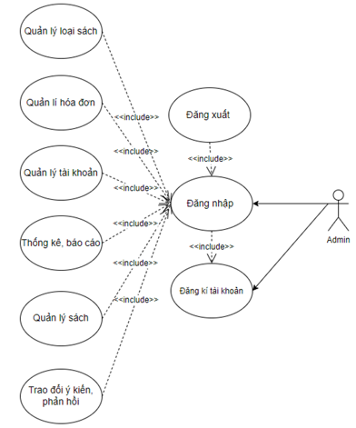
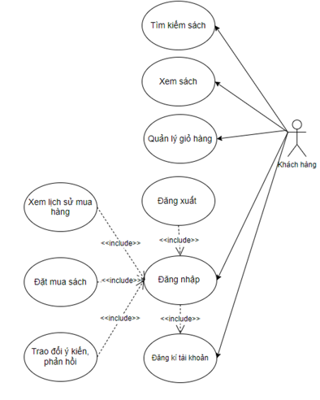
#### 2.2.2 Biểu đồ UseCase Đăng ký
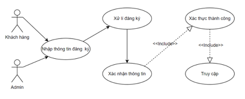

#### 2.2.3 Biểu đồ UseCase Đăng nhập
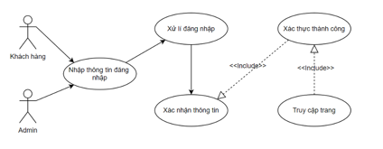
#### 2.2.4 Biểu đồ Use Case Giỏ hàng:
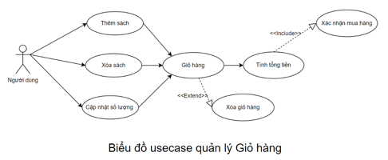
#### 2.2.5 Biểu đồ Use Case quản lý sách :
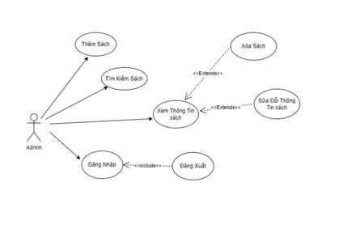
#### 2.2.6 Biểu Đồ Use Case Quản lý loại sách
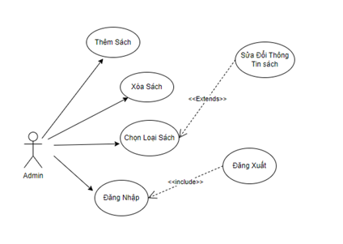
### 2.3 Biểu đồ hoạt động :

#### 2.3.1. Biểu đồ hoạt động đăng nhập :
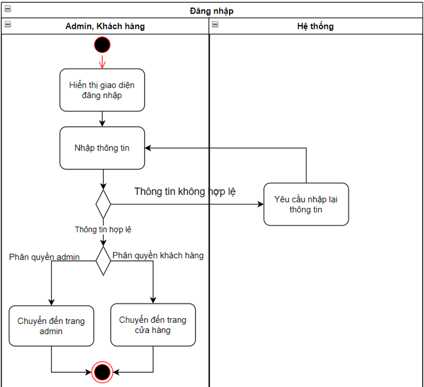
#### 2.3.2. Biểu đồ hoạt động đăng ký :
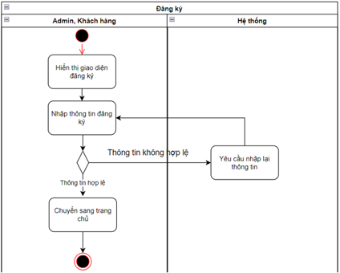
#### 2.3.3 Biểu đồ hoạt động xoá sách :
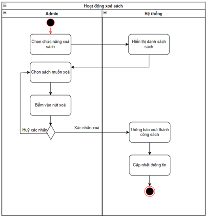
#### 2.3.4 Biểu đồ hoạt động Thêm sách
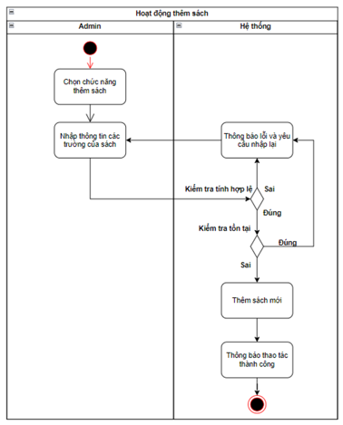
#### 2.3.5 Biểu đồ hoạt động Sửa sách
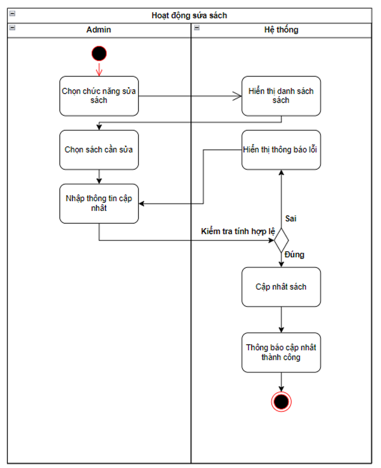
#### 2.3.6 Biểu đồ hoạt động Tìm kiếm sách :
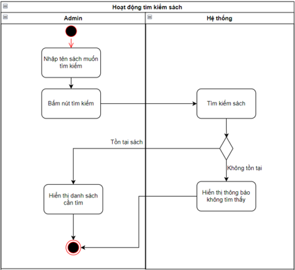
#### 2.3.7 Biểu đồ hoạt động xóa loại sách
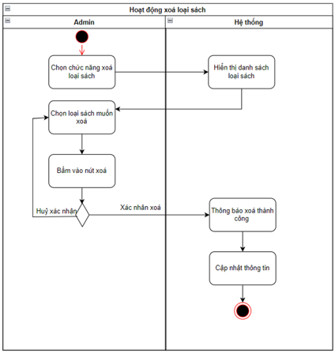
#### 2.3.8 Biểu đồ hoạt động Tìm kiếm loại sách :
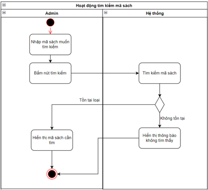
#### 2.3.9 Biểu đồ hoạt động Sửa loại sách
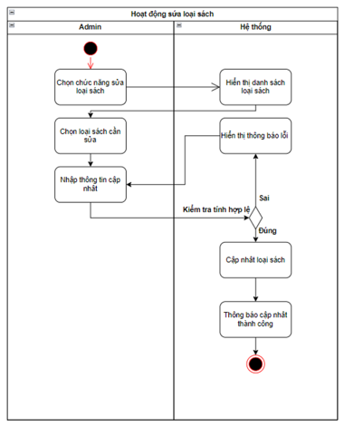
#### 2.3.10 Biểu đồ hoạt động Thêm loại sách
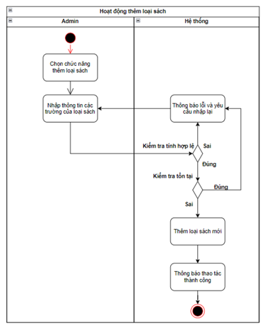
#### 2.3.11 Biểu đồ hoạt động Thêm sách vào giỏ
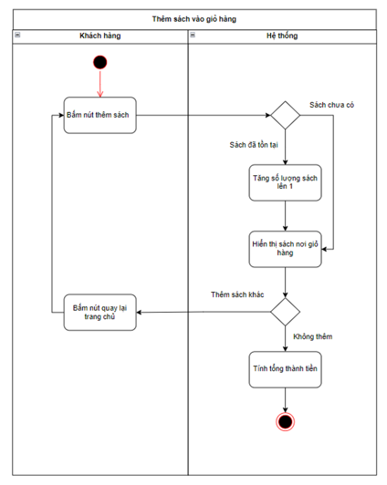
#### 2.3.12 Biểu đồ hoạt động Sửa sách trong giỏ
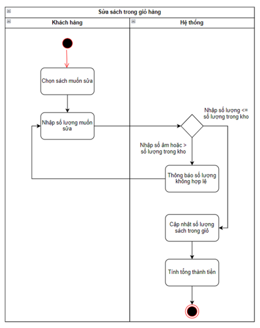
#### 2.3.13 Biểu đồ hoạt động Xóa sách trong giỏ hàng
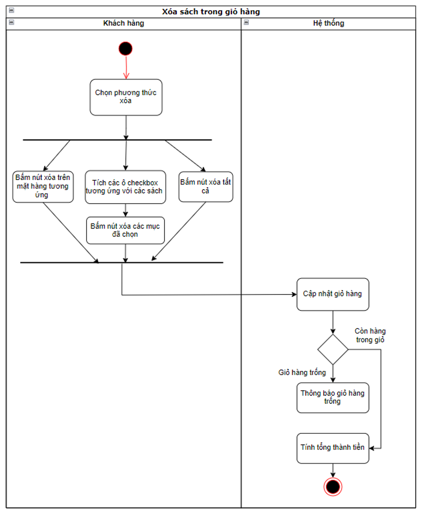
### 2.4 Biểu đồ tuần tự:

#### 2.4.1 Biểu đồ tuần tự thêm hàng vào giỏ:
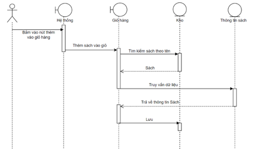
#### 2.4.2 Biểu đồ tuần tự sửa hàng trong giỏ:
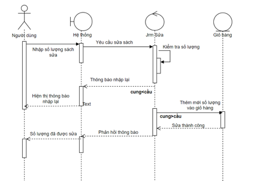
#### 2.4.3 Biểu đồ tuần tự xóa sách trong giỏ:
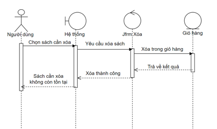
#### 2.4.4 Biểu đồ tuần tự đăng nhập :
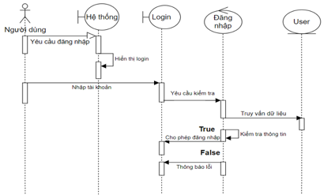
#### 2.4.5 Biểu đồ tuần tự đăng ký
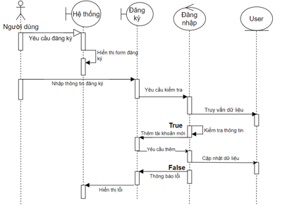
#### 2.4.6 Biểu đồ tuần tự sửa thông tin sách :
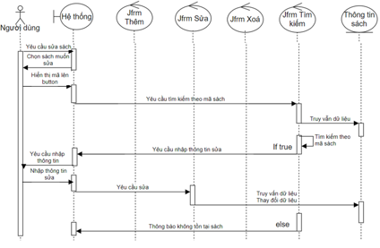
#### 2.4.7 Biểu đồ tuần tự tìm sách :
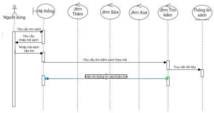
#### 2.4.8 Biểu đồ tuần tự xoá sách:
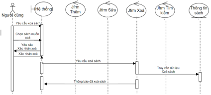
### 3. Mã nguồn - Mô Mô tả thuật toán

#### 3.1 Chức năng sửa sách :
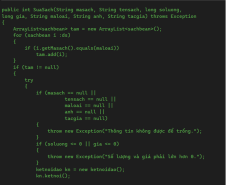
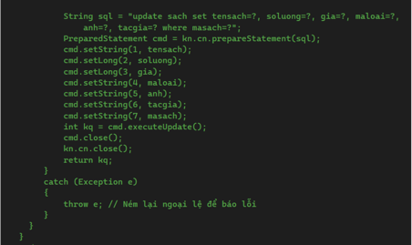
#### 3.1 Chức năng thêm loại sách:
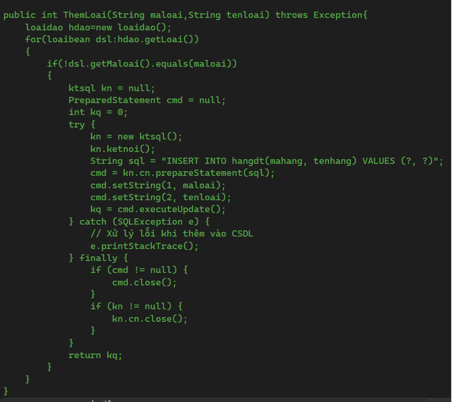
